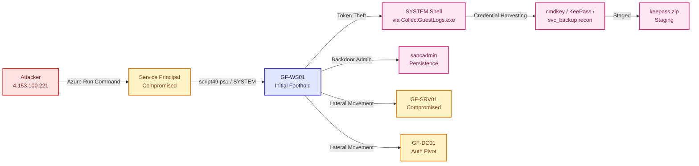

# Incident Report — GF-INC-2026-0704 "Hidden Directive"

**Analyst:** Danielle R
**Date:** August 1, 2026
**Telemetry sources:** LAW-SilentCorridor, LAW-Cyber-Range (Sentinel) · Defender XDR (MDE)
**Scope:** GF-WS01, GF-SRV01, GF-DC01 · 4 Jul 2026 10:00 UTC – 5 Jul 2026 03:00 UTC

## Executive Summary

| Category | Details |
| :--- | :--- |
| **Initial Access Vector** | Compromised Azure Service Principal (`5deb2a08...`) via Run Command |
| **Impact & Breadth** | SYSTEM-level code execution on GF-WS01 & backdoor persistence established |
| **Scope & Telemetry** | 3 endpoints (GF-WS01, GF-SRV01, GF-DC01) · Microsoft Sentinel & Defender XDR |

On 4 July 2026, GF-WS01 at Greenfield Logistics triggered alerts, the MSSP escalated, and a P1 incident was declared. This report reconstructs initial access, privilege escalation, credential access, lateral movement, and staging across three hosts, every claim cited to telemetry.

## Attack Narrative

An attacker used a **compromised Azure Service Principal** to issue a Run Command against GF-WS01, executing `script49.ps1` with SYSTEM privileges and establishing a backdoor local admin account, `sancadmin` (C01, C02). From there, `sancadmin` **stole a SYSTEM access token** from `StoreDesktopExtension.exe` and assigned it to `CollectGuestLogs.exe`, spawning a SYSTEM shell without triggering standard persistence detections (C05).

With SYSTEM access, the attacker **harvested credentials** across multiple vectors — stored credentials for `m.smith`, the local KeePass vault, and reconnaissance against the `svc_backup` service account — while prepping for an LSASS dump (C07). Harvested material was **staged into `keepass.zip`** on GF-WS01, though the exfiltration channel itself is not evidenced in available telemetry (C11).

In parallel, the attacker **moved laterally** via two independent routes — a Pass-the-Hash using the `GF-SRV01$` computer account, and a compromised `t.harris` domain account — both converging on `GF-DC01` via Kerberos Overpass-the-Hash. GF-DC01 became the **persistent authentication pivot** for the rest of the operation, later used by both `m.smith` and the `sancadmin` backdoor (C09).

## Attack Flow

## Phase-by-Phase Findings

| Phase | Summary | Doc |
|---|---|---|
| Access & Environment | Scope and telemetry confirmed across 3 hosts | C01 |
| Initial Access | Compromised Azure SP → Run Command → SYSTEM execution → backdoor account | C02 |
| Privilege Escalation | Access token theft, SYSTEM shell via LOLBin abuse | C05 |
| Credential Access | Stored creds, KeePass vault, svc_backup recon, LSASS prep | C07 |
| Lateral Movement | Dual-route Pass-the-Hash/Overpass-the-Hash into GF-DC01 | C09 |
| Staging & Exfiltration | Credential material archived; exfil channel unconfirmed | C11 |

## MITRE ATT&CK Summary

See [mitre-mapping.md](./mitre-mapping.md) for the full technique-by-evidence table (T1078, T1059, T1136, T1134, T1574, T1555, T1003, T1087, T1550.002, T1550.003, T1560, T1074).

## Detection Recommendations

Consolidated from all phases — see [remediation-draft.md](./remediation-draft.md) for the full list. Highest-priority gaps:

1. No alerting on Azure Run Command from Service Principals outside CI/CD.
2. Token-manipulation events (MDE-only) not onboarded into Sentinel.
3. Credential-store and password-manager access patterns unmonitored.
4. No baseline for Kerberos ticket volume through GF-DC01 to catch lateral-movement pivots.

## Known Gaps

See [investigation-gaps.md](./investigation-gaps.md) — most notably, the exfiltration transport for staged credential data is not confirmed in current telemetry, and a Jul 8 registry-modification artifact (`aggregatorhost.exe`) falls outside the core incident window and needs separate scoping.

---
*LOG(N) Pacific Cyber Range // Hidden Directive // GF-INC-2026-0704 // Built by SancLogic*
